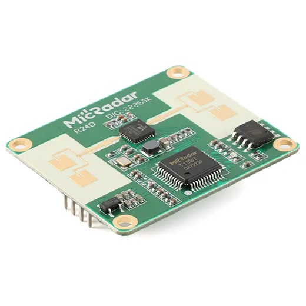

# R24D

</img>

R24D is a low cost 24Ghz mmWave radar with presence and movement detection.

Tested with:
- MicRadar R24DVD1 - [AliExpress](https://s.click.aliexpress.com/e/_DEaKFRN)
- Seeedstudio MR24HPC1 - [SeeedStudio store](https://www.seeedstudio.com/24GHz-mmWave-Sensor-Human-Static-Presence-Module-Lite-p-5524.html?sensecap_affiliate=jo7uUTK)

Module uses 2.0 headers so you'll need [2.0mm to 2.54mm cables](https://www.aliexpress.com/item/32404830160.html?aff_fcid=bde844456ec84feca957bdb73f9e0b72-1698946372209-00940-_DnMZzwr&tt=CPS_NORMAL&aff_fsk=_DnMZzwr&aff_platform=shareComponent-detail&sk=_DnMZzwr&aff_trace_key=bde844456ec84feca957bdb73f9e0b72-1698946372209-00940-_DnMZzwr) to connect to the radar module. Another option are these [2 row header Dupont cables (2x3P)](https://www.aliexpress.com/item/1005004327111557.html?aff_fcid=d990ff4f1a7a4e808378e32a40aecad3-1690136370877-04300-_DcwFFoX&tt=CPS_NORMAL&aff_fsk=_DcwFFoX&aff_platform=shareComponent-detail&sk=_DcwFFoX&aff_trace_key=d990ff4f1a7a4e808378e32a40aecad3-1690136370877-04300-_DcwFFoX&terminal_id=3f8c776975fd455ba956809c02d71a91&afSmartRedirect=y) that can be soldered to the board.

Set Serial Tx and Serial Rx pins in Tasmota to the pins connected to RX and TX pins on the module.

Driver supports all standard functions. Underlying Open protocol and scene configuration commands are not included because those are advanced commands but can still be issued using `RadarSend` command.

Load driver from autoexec.be with `load('r24d.be')`.

## Commands

### SetDelay

Set delay time for no presence state

| Parameter | Value | 
| :--- | --- | 
| `0` | None |
| `1` | 10s | 
| `2` | 30s | 
| `3` | 1min |
| `4` | 2min |
| `5` | 5min |
| `6` | 10min |
| `7` | 30min |
| `8` | 60min |

### SetSensitivity

Set detection distance for static state

| Parameter | Sensitivity | Detection Radius (m)
| :--- | --- | ---
| `1` | Level 1 | 2.5m
| `2` | Level 2 | 3m
| `3` | Level 3 | 4m

### SetScene

Set predefined scene mode

| Parameter | Scene Mode | Detection Radius (m)
| :--- | --- | ---
| `1` | Living room | 4m - 4.5m
| `2` | Bedroom | 3.5m - 4m
| `3` | Bathroom | 2.5m - 3m
| `4` | Area detection | 3m - 3.5m

### RadarRestart

Sends restart command to the radar module.

### RadarSend

`control_word,comand_word,hex_value` is the expected format. If value is missing it `0F` will be entered instead. There is zero error checking and if something is wrong it will fail silently

## Body Movement Parameter

Explaining body movement parameter values

| value | description | motion 
| | | 
| 0% | unmanned | unmanned environment
| 1% | still (sleep) | Only breathing without limb movement
| 2%-30% | micro-motion | Only slight head or limb movement
| 31%-60% | walking/rapid body movements | slower motion
| 61%-100% | running/close range | rapid motion