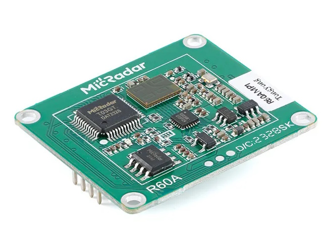

# R60AMP1

</img>

R60AMP1 is a 60Ghz mmWave radar with multi-person trajectory detection.

  
Module uses 2.0 headers so you'll need [2.0mm to 2.54mm cables](https://www.aliexpress.com/item/32404830160.html?aff_fcid=bde844456ec84feca957bdb73f9e0b72-1698946372209-00940-_DnMZzwr&tt=CPS_NORMAL&aff_fsk=_DnMZzwr&aff_platform=shareComponent-detail&sk=_DnMZzwr&aff_trace_key=bde844456ec84feca957bdb73f9e0b72-1698946372209-00940-_DnMZzwr) to connect to the radar module. 

 [Everything Presence Lite Kit](https://templates.blakadder.com/everything_presence_lite.html) has built in headers to easily use the sensor.  
 Another option are these [2 row header Dupont cables (2x3P)](https://www.aliexpress.com/item/1005004327111557.html?aff_fcid=d990ff4f1a7a4e808378e32a40aecad3-1690136370877-04300-_DcwFFoX&tt=CPS_NORMAL&aff_fsk=_DcwFFoX&aff_platform=shareComponent-detail&sk=_DcwFFoX&aff_trace_key=d990ff4f1a7a4e808378e32a40aecad3-1690136370877-04300-_DcwFFoX&terminal_id=3f8c776975fd455ba956809c02d71a91&afSmartRedirect=y) that can be soldered to the board.

Set Serial Tx and Serial Rx pins in Tasmota to the pins connected to RX and TX pins on the module.

| Micradar | ESP |
|---|---|
| Vcc |5V       |
| GND |GND      |
| RX  |Serial Tx  |
| TX  | Serial Rx | 

Driver supports all functions from the provided datasheet but my unit reported only trajectory data.

Load driver from autoexec.be with `load('r60amp1.be')`.

## Commands

### RadarSend

`control_word,comand_word,hex_value` is the expected format. If value is missing it `0F` will be entered instead. There is zero error checking and if something is wrong it will fail silently

### RadarRestart

Sends restart command to the radar module.